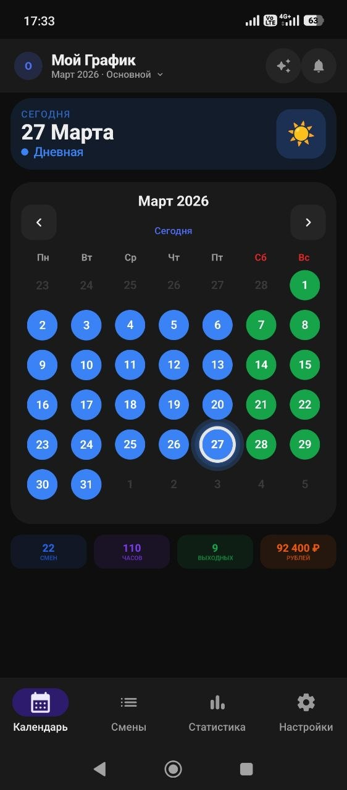
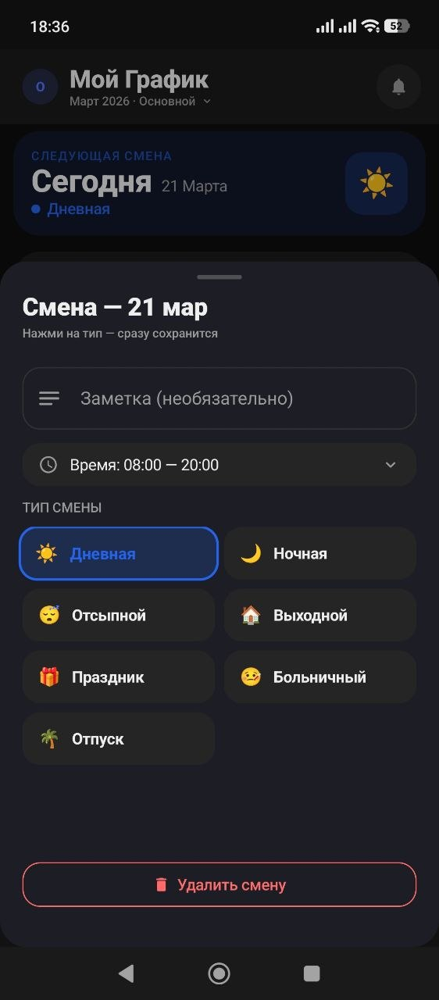
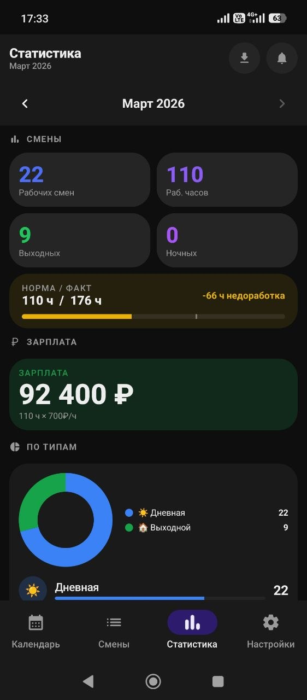
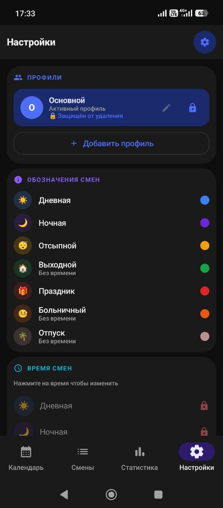

<div align="center">


# 📅 Мой График

**Приложение для учёта рабочих смен на Android**

[](https://android.com)
[](https://kotlinlang.org)
[](https://developer.android.com/jetpack/compose)
[](https://developer.android.com/training/data-storage/room)
[](LICENSE)
[]()

[**Возможности**](#-возможности) · [**Скриншоты**](#-скриншоты) · [**Установка**](#-установка) · [**Архитектура**](#-архитектура)

</div>

---

## 🌟 О приложении

**Мой График** — нативное Android-приложение для работников со сменным графиком. Веди расписание смен, получай уведомления, отслеживай статистику и экспортируй данные в PDF.

> Полностью написано на **Kotlin + Jetpack Compose** с современным Android-стеком и чистой архитектурой MVVM.

---

## ✨ Возможности

### 📅 Календарь
- Месячная сетка смен с цветовой кодировкой по типам
- **Автозаполнение по шаблонам**: 2/2, 3/3, 5/2, 6/1, сутки/трое и другие
- Заполнение с любой даты до конца месяца или до конца года
- **Карточка "СЕГОДНЯ"** — показывает текущую дату и смену
- Автопереход к текущей дате при открытии вкладки
- Кнопка автозаполнения (✨) в хедере

### 📊 Статистика
- Подсчёт рабочих, ночных смен, выходных, больничных и праздничных
- Расчёт зарплаты с ночным, праздничным и больничным коэффициентами
- Учёт обедов и перерывов при подсчёте рабочих часов
- Норма часов, переработки, история за год
- **Месяцы отображаются от текущего к будущим**
- Экспорт в PDF с выбором периода

### 🔒 Блокировка данных (isLocked)
- Защита смен от случайного редактирования/удаления
- При включённой блокировке:
  - Время смен недоступно для редактирования
  - Слайдер перерыва заблокирован
  - Кнопки очистки месяца/года недоступны
  - Визуальное затемнение (opacity 0.5)

### 👤 Профили
- Несколько независимых профилей (для разных работ / членов семьи)
- Замок от случайного удаления 🔒
- Переименование профилей ✏️
- Переключение одним касанием

### ⚙️ Настройки
- **ВРЕМЯ СМЕН** — настройка времени для всех типов смен (день, ночь, праздник, отсыпной, больничный)
- **Перерыв/обед** — теперь в секции "ВРЕМЯ СМЕН" (логически связано)
- **ОБОЗНАЧЕНИЯ СМЕН** — легенда с цветами и иконками (ранее была под календарём, теперь в настройках)
- **ЗАРПЛАТА И РАБОЧЕЕ ВРЕМЯ** — ставка, коэффициенты
- **КОНФИГУРАЦИЯ ДАННЫХ** — автозаполнение, шаблоны, очистка месяца/года

### 🗑 Очистка данных
- Очистить месяц — удаление всех смен за выбранный месяц
- Очистить год — удаление всех смен за год
- Подтверждение с предупреждением

### 🔔 Уведомления
- Напоминание за N часов до начала смены
- Собственный звук уведомления
- Автовосстановление после перезагрузки телефона
- Напоминание заполнить следующий месяц (25-го числа)

### 🧩 Виджет рабочего стола
- Три размера: Small (2×1), Medium (2×2), Large (4×2)
- Показывает дату, день недели, ближайшие смены
- Автообновление каждый час через WorkManager
- Время работы только для рабочих смен

### 🎨 UX / Анимации
- Заставка в стиле Telegram (расходящиеся круги)
- 12 анимационных утилит
- Плавные переходы 350 мс
- Градиентные кнопки, анимация замка, пульс сегодняшней даты
- Полная поддержка светлой и тёмной тем

### 💾 Резервное копирование
- Экспорт всех данных (настройки, профили, время смен, график) в JSON
- Импорт из резервной копии
- **Автобэкап** — автоматическое сохранение в папку Загрузки/MoyGrafik (опционально)

---

## 📸 Скриншоты

<div align="center">

| Календарь | Смены | Статистика | Настройки |
|:---------:|:-----:|:----------:|:---------:|
|  |  |  |  |

</div>

---

## 🛠 Стек технологий

| Категория | Технология | Версия |
|-----------|-----------|--------|
| **UI** | Jetpack Compose + Material 3 | BOM 2024.02 |
| **Язык** | Kotlin | 1.9.22 |
| **Архитектура** | MVVM + Repository + Hilt | 2.50 |
| **База данных** | Room + SQLite | 2.6.1 |
| **Навигация** | Navigation Compose | 2.7.6 |
| **Фоновые задачи** | WorkManager + AlarmManager | 2.9.0 |
| **Виджет** | Glance AppWidget | 1.1.0 |
| **Безопасность** | EncryptedSharedPreferences | 1.0.0 |
| **DI** | Hilt | 2.50 |
| **Min SDK** | Android 8.0 | API 26 |
| **Target SDK** | Android 14 | API 34 |

---

## 📁 Архитектура

### Структура проекта

```
app/src/main/java/ru/tabel/app/
│
├── MainActivity.kt                    # Точка входа, Bottom Navigation
├── TabelApplication.kt                # Hilt, WorkManager, инициализация
├── SettingsViewModel.kt               # Глобальный ViewModel настроек
│
├── data/
│   ├── db/
│   │   ├── TabelDatabase.kt          # Room БД (version 13), миграции
│   │   └── Daos.kt                   # ShiftDao, ProfileDao, SettingsDao, ShiftTimeDao
│   ├── model/
│   │   └── Models.kt                 # ShiftEntry, ShiftType, Profile, AppSettings, ShiftTime
│   └── repository/
│       └── TabelRepository.kt        # Единая точка доступа к данным
│
├── di/
│   ├── AppModule.kt                  # Hilt модуль (миграции БД)
│   └── WidgetWorkerEntryPoint.kt     # EntryPoint для Worker
│
├── notifications/
│   ├── TabelNotificationManager.kt   # AlarmManager, каналы, звуки
│   ├── NotificationReceiver.kt       # BroadcastReceiver
│   └── BootReceiver.kt              # Восстановление после перезагрузки
│
├── ui/
│   ├── calendar/
│   │   ├── CalendarScreen.kt         # Главный экран, календарь, карточка "Сегодня"
│   │   ├── CalendarViewModel.kt      # Логика календаря, автозаполнение
│   │   ├── AutofillDialog.kt         # Диалог автозаполнения (месяц/год)
│   │   └── StatsStrip.kt             # Мини-статистика под календарём
│   │
│   ├── shifts/
│   │   └── ShiftsScreen.kt          # Список всех смен с фильтрами
│   │
│   ├── stats/
│   │   ├── StatsScreen.kt            # Статистика, графики
│   │   ├── StatsViewModel.kt         # Логика статистики
│   │   └── ExportDialog.kt           # Экспорт в PDF
│   │
│   ├── settings/
│   │   ├── SettingsScreen.kt         # Все настройки приложения
│   │   └── NotifSheet.kt             # Настройки уведомлений
│   │
│   ├── profile/
│   │   ├── ProfileScreen.kt          # Управление профилями
│   │   └── ProfileViewModel.kt       # Логика профилей
│   │
│   ├── splash/
│   │   └── SplashScreen.kt           # Заставка при запуске
│   │
│   ├── onboarding/
│   │   └── OnboardingScreen.kt       # Экран онбординга
│   │
│   ├── components/                   # Переиспользуемые компоненты
│   └── theme/                        # Тема + типографика + анимации
│
├── backup/
│   └── AutoBackupWorker.kt           # Автобэкап в папку Загрузки/MoyGrafik
│
└── widget/
    ├── ShiftWidget.kt                 # Glance виджет (3 размера)
    ├── WidgetUpdater.kt              # Обновление данных виджета
    └── WidgetUpdateWorker.kt         # WorkManager worker
```

### Поток данных (Data Flow)

```
┌──────────────────────────────────────────────────────────────────┐
│                        UI Layer (Compose)                        │
│  CalendarScreen │ StatsScreen │ SettingsScreen │ ProfileScreen   │
└────────────────────────────┬─────────────────────────────────────┘
                             │ StateFlow /.collectAsState
                             ▼
┌──────────────────────────────────────────────────────────────────┐
│                    Presentation Layer                            │
│  CalendarViewModel │ StatsViewModel │ SettingsViewModel          │
│  ProfileViewModel                                                │
└────────────────────────────┬─────────────────────────────────────┘
                             │ suspend functions / StateFlow
                             ▼
┌──────────────────────────────────────────────────────────────────┐
│                      Domain Layer                                │
│                    TabelRepository                               │
│  - getAllShiftsForProfile()                                      │
│  - autofillMonth() / autofillYear()                              │
│  - clearMonth() / clearYear()                                    │
│  - getMonthStats()                                               │
│  - saveSettings() / restoreShifts()                              │
└────────────────────────────┬─────────────────────────────────────┘
                             │
           ┌─────────────────┼─────────────────┐
           ▼                 ▼                 ▼
┌──────────────────┐ ┌──────────────────┐ ┌──────────────────────┐
│    Room DB       │ │ SharedPreferences│ │   WorkManager        │
│  (shifts,        │ │  (profile locks, │ │  (notifications,     │
│   profiles,      │ │   widget cache)  │ │   backup, widget)    │
│   settings)      │ │                  │ │                      │
└──────────────────┘ └──────────────────┘ └──────────────────────┘
```

### Основные сущности БД

| Таблица | Описание |
|---------|---------|
| `shifts` | Смены (date, profileId, type, note, customStartTime, customEndTime, locked) |
| `profiles` | Профили (id, name, color, isActive) |
| `shift_times` | Время смен (type, startTime, endTime) |
| `settings` | Настройки приложения (isLocked, breakMinutes, hourlyRate, коэффициенты...) |
| `shift_templates` | Пользовательские шаблоны автозаполнения |

---

## 🎨 Типы смен

| Тип | Цвет | Код | Описание |
|-----|------|-----|----------|
| ☀️ Дневная | 🔵 Синий | `#3B82F6` | Стандартная дневная смена |
| 🌙 Ночная | 🟣 Фиолетовый | `#6D28D9` | Ночная смена |
| 😴 Отсыпной | 🟠 Янтарный | `#F59E0B` | После ночной смены |
| 🏠 Выходной | 🟢 Зелёный | `#16A34A` | Выходной день |
| 🎁 Праздник | 🔴 Красный | `#DC2626` | Праздничный день |
| 🤒 Больничный | 🟠 Оранжевый | `#EA580C` | Больничный лист |
| 🌴 Отпуск | 🟤 Песочный | `#BC8F8F` | Отпуск |

---

## 🚀 Установка

### Требования
- **Android Studio** Hedgehog 2023.1.1 или новее
- **JDK** 17
- **Android SDK** 34

### Сборка из исходников

```bash
# 1. Клонировать репозиторий
git clone https://github.com/YOUR_USERNAME/moygrafik.git
cd moygrafik

# 2. Собрать debug APK
./gradlew assembleDebug

# 3. Установить на подключённое устройство
./gradlew installDebug
```

### Ключевые зависимости

```gradle
// BOM для Compose
implementation platform('androidx.compose:compose-bom:2024.02.00')

// Dependency Injection
implementation 'com.google.dagger:hilt-android:2.50'

// База данных
implementation "androidx.room:room-runtime:2.6.1"
implementation "androidx.room:room-ktx:2.6.1"

// Виджет
implementation 'androidx.glance:glance-appwidget:1.1.0'
implementation 'androidx.glance:glance-material3:1.1.0'

// Фоновые задачи
implementation 'androidx.work:work-runtime-ktx:2.9.0'

// Безопасное хранение
implementation 'androidx.security:security-crypto:1.0.0'
```

---

## 🗄 История базы данных

| Версия | Изменение |
|--------|-----------|
| 1 → 2 | Добавлены themeMode, cloudBackup |
| 2 → 3 | No-op (совместимость) |
| 3 → 4 | Добавлен sickCoeff |
| 4 → 5 | Добавлен notifDayTime |
| 5 → 6 | Пересоздание таблицы settings |
| 6 → 7 | Финальная санация схемы |
| 7 → 8 | Добавлен breakMinutes (перерывы) |
| 8 → 13 | isLocked (блокировка данных) |

---

## 📄 Лицензия

```
MIT License — Copyright (c) 2026 Alexandr Zudikov

Разрешается свободное использование, копирование и изменение
при сохранении оригинального авторства.
```

---

*Если приложение полезно — поставь ⭐ звезду на GitHub!*

</div>
